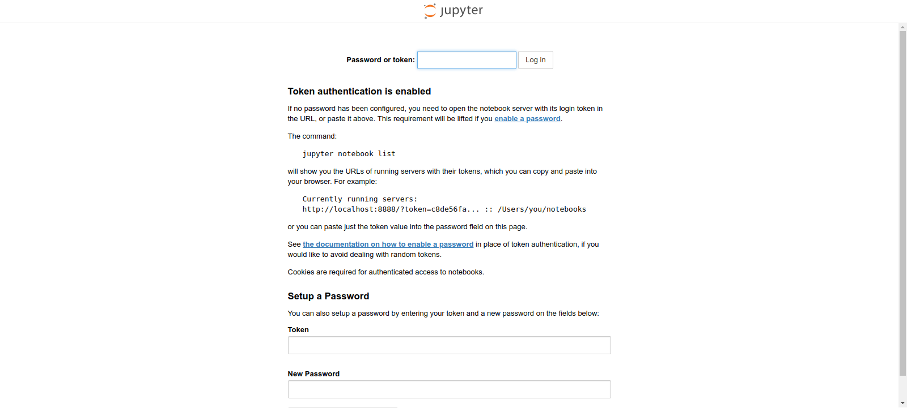
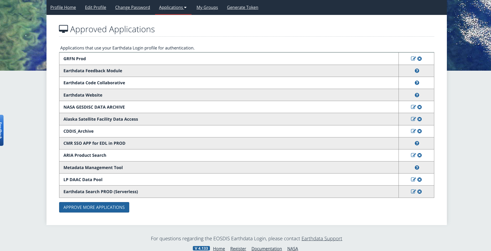
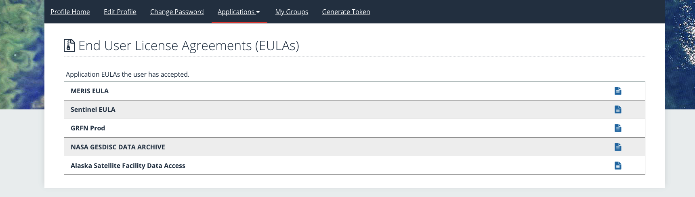

# Setting up kamb & kraken

We will use [Python](https://www.python.org/) and [Jupyter Notebooks](https://jupyter.org/) for computation, Python's [matplotlib](https://matplotlib.org/) module for simple plots and [Generic Mapping Tools (GMT)](https://www.generic-mapping-tools.org/) for plotting maps. Here are some guidance of setting up the computer (Kamb) ready for the InSAR related works

Things that will be covered here:

- Paths and environments settings on Kamb (named after the glaciologist [Barclay Kamb](https://calteches.library.caltech.edu/4534/1/Obituary.pdf); The server of Mark Simons group where we run heavy computations)
- Setup to run Jupyter notebooks on Kamb
  - Jupyter notebook provides a Matlab-like interface to run python code and display results and plots.
  - There are several useful notebooks for the tutorials of `ARIA-tools` and `MintPy` available provided by the developers.
- Installation of `ARIA-tools` and `MintPy` 


Let's get started!

<br />

## 0. SSH to Kamb (a setup for the laziness from human nature)

In order get into the Kamb server, you will need to do the ssh every time, such as, `ssh username@kamb.gps.caltech.edu`. This requires you to enter the password every time. There is a way to avoid entering password so frequently. Checkout this [guidance](https://www.thegeekstuff.com/2008/11/3-steps-to-perform-ssh-login-without-password-using-ssh-keygen-ssh-copy-id/) (Step1 to Step3 will do it).

<br />

After setting the above, we don't need to type password every time. But we still need to type our username and the full IP address when doing ssh, i.e., `ssh username@kamb.gps.caltech.edu`

To further save some effort, we can create SSH alias names. Do the following on our laptop:

```bash
# First open the terminal on your laptop

# go into .ssh directory (if not exist, make one)
cd ~/.ssh

# create or edit a config file
vi config


## ========================================== ##
##   Paste the following in that config file  ##
## ========================================== ##

# KAMB server: Mark Simon's group
Host kamb
    Hostname kamb.gps.caltech.edu
    User my_name
    ServerAliveInterval 720
    ServerAliveCountMax 120
    ForwardX11Timeout = 24h

# EARTH server: Caltech GPS server
Host earth
    Hostname earth.gps.caltech.edu
    User my_name
    ServerAliveInterval 720
    ServerAliveCountMax 120
    ForwardX11Timeout = 24h
```


Now, you don't need to type the username and the full IP address. From your laptop, you can log into Kamb by simply doing:

```bash
ssh kamb
```

<br />


## 1. Access to Kraken

- Kraken is another server especially meant to store data. It is named after the [sea monster in Scandinavian folklore](https://en.wikipedia.org/wiki/Kraken); like a hub connecting to other machines with its' strong and agile tentacles.
- Two subfolders under Kraken: `bak` (60-day backup for saving just codes) and `nobak` (no backup for saving Gigabyte-sized datasets)

```bash
# SSH to Kamb server, you will be at your home directory on Kamb
ssh username@kamb.gps.caltech.edu

# Go kraken, the no backup directory for storting large dataset (up to 20TB)
cd /net/kraken/nobak/

# make your own folder here
mkdir my_name

# make a symbolic link of this path to your home directory
ln -s /net/kraken/nobak/my_name ~/kraken-nobak

# Go to kraken, the 60-day backup directory for storing codes, notes, etc (up to 5TB)

# make your own folder here
mkdir my_name

# make a symbolic link of this path to your home directory
ln -s /net/kraken/bak/my_name ~/kraken-bak

## Now everytime you log on kamb, you will see and can `cd` into kraken (either bak or nobak)
## easily without needing to type the full paths to access them.
```


<br />


## 2. Install Miniconda on Kamb

```bash
# Go to kamb (a lazy way here)
ssh kamb

# Create a tools directory (for all the downloaded softwares, source codes) at your home directory on Kamb
# -p command: make this directory if not exist. Then we `cd` into tools folder
mkdir -p ~/tools; cd ~/tools

# download (mini/ana)conda. Miniconda is better, a light version without many useless stuff
wget https://repo.anaconda.com/miniconda/Miniconda3-latest-Linux-x86_64.sh

# make the bash script executable
chmod +x Miniconda3-latest-Linux-x86_64.sh

# run it to install
./Miniconda3-latest-Linux-x86_64.sh -b -p ~/tools/miniconda3
~/tools/miniconda3/bin/conda init bash

# Close and restart the shell for changes to take effect.
exit                 # logout
ssh kamb				     # login again

# First, set conda-forge as default conda channels 
conda config --add channels conda-forge
conda config --set channel_priority strict

# now you can make your new conda env and install stuff under that env
conda create --name your_new_env
conda activate your_new_env
conda install some_packages_you_want

```

Reference of the above guidance: [Yunjun's GitHub repository](https://github.com/yuankailiu/conda_envs) (Yunjun is the postdoc here. He is the developer of MintPy. so, we will use this site again when installing MintPy)


<br />


## 3. Git

We will use `git` to get the source codes of `ARIA-tools` (getting the InSAR unwrapped datasets) and `MintPy` (doing InSAR time-series analysis).

[git](https://git-scm.com/) is an open source [version control system](https://www.atlassian.com/git/tutorials/what-is-version-control). You can find some very basic tutorials online if you are bored. Otherwise, we will only use the very basic stuff of `git` (e.g. how to download source codes of a open source software). The things explained in this document about `git` will be enough for us now.

1. You might already have `git` installed on Kamb. If not, simply install it in the `base` conda env

   ```bash
   # Go to Kamb
   ssh kamb
   
   # You are now at the base env. The prompt will show (base)
   
   # Install git via conda
   conda install git
   
   # check git version (you should have version >= 2.30.2)
   git version
   ```

   

2. Now we can downlaod the "softwares" of ARIA-tools and MintPy. They are just a bunch of source codes written in Python, C, etc

   ```bash
   # Go to the tools folder on Kamb
   cd ~/tools
   
   # use git clone to download these open source softwares reposited at GitHub
   git clone https://github.com/aria-tools/ARIA-tools.git
   git clone https://github.com/insarlab/MintPy.git
   git clone https://github.com/insarlab/PySolid.git
   git clone https://github.com/yunjunz/PyAPS.git
   
   # Also, git clone the documentation and tutorials for the ARIA-tools
   git clone https://github.com/aria-tools/ARIA-tools-docs.git
   
   # Now you can see these folders (ARIA_tools, MintPy, PySolid, PyAPS) under tools directory
   ls
   ```

   

Next, we will start to prepare the python environment and install some pre-requisites for running the above softwares.


<br />


## 4. Setting up `conda` Python environment

1. Prepare the `base` environment for running Jupyter Notebook. Do the following:

   ```bash
   # First, the env you want to launch Jupyter (usually the base env) should intalled with nb_conda
   conda activate base
   conda install --channel conda-forge nb_conda
   ```

   

2. Prepare a new environment for `ARIA-tools` and `MintPy` and their dependencies. We will create a new environment called `insar`. Do the following:

   ```bash
   # Create a new env for the InSAR softwares (ARIA-tools and MintPy)
   conda create -n insar    # create the env called "insar"
   conda activate insar		 # warm up the "insar" env
   
   # Install some packages:
   # - python
   # - numpy
   # - matplotlib: matlab-like plotting in python
   # - jupyter: jupyter notebook
   # - jupyterlab: jupyter lab (an advanced, powered version of jupyter notebook)
   conda install --channel conda-forge --yes python numpy matplotlib jupyter jupyterlab
   
   # Install the packages required by those softwares (ARIA-tools, MintPy)
   conda install --channel conda-forge --yes --file ~/tools/MintPy/docs/conda.txt --file ~/tools/ARIA-tools/requirements.txt
   
   # Install third-party dependencies required by ARIA-tools (not available from conda)
   # Simply run the `setup.py` script which allows for easy compilation and installation of third-party dependencies (c-code).
   cd ~/tools/ARIA-tools/
   python setup.py build
   python setup.py install
   
   # Install third-party dependencies required by MintPy (not available from conda)
   ln -s ${CONDA_PREFIX}/bin/cython ${CONDA_PREFIX}/bin/cython3
   $CONDA_PREFIX/bin/pip install git+https://github.com/tylere/pykml.git
   $CONDA_PREFIX/bin/pip install scalene      # CPU, GPU and memory profiler
   $CONDA_PREFIX/bin/pip install ipynb        # import functions from ipynb files
   
   # Compile PySolid (requireed by MintPy)
   cd ~/tools/PySolid/pysolid
   f2py -c -m solid solid.for
   
   ```

   

3. Set the following environment variables (paths) in your  `~/.bashrc`  on Kamb. So that every time when you log in Kamb, the paths of ARIA-tools and MintPy are all set automatically, and you can call their functions whereever you are on Kamb.

   ```bash
   # Open the .bashrc file at your home directory on Kamb
   vi ~/.bashrc
   
   ## ====================================================================== ##
   ##          Paste the following to the end of the .bashrc file            ##
   ## ====================================================================== ##
   
   # Define the root directory
   export TOOL_DIR=~/tools
   export DATA_DIR=~/data   # data / nobak
   
   if [ -z ${PYTHONPATH+x} ]; then export PYTHONPATH=""; fi
   
   ##-------------- MintPy / PyAPS / PySolid -------------##
   export MINTPY_HOME=${TOOL_DIR}/MintPy
   export PYTHONPATH=${PYTHONPATH}:${MINTPY_HOME}:${TOOL_DIR}/PyAPS:${TOOL_DIR}/PySolid
   export PATH=${PATH}:${MINTPY_HOME}/mintpy
   export WEATHER_DIR=${DATA_DIR}/aux
   
   ##-------------- ARIA-tools ---------------------------##
   export ARIATOOLS_HOME=${TOOL_DIR}/ARIA-tools/tools
   export PYTHONPATH=${PYTHONPATH}:${ARIATOOLS_HOME}
   export PATH=${PATH}:${ARIATOOLS_HOME}/bin
   ```

   

4. Now, `exit` Kamb (or just close the terminal) and re-login to see if all the installations are good.

   ```bash
   # disconnect kamb, or just close the terminal
   exit
   
   # re-login
   ssh kamb
   
   # first activate the `insar` conda env
   # you must activate it every time you log in to use this env
   conda activate insar
   
   # testing these softwares
   ariaDownload.py -h       # test ARIA-tools
   smallbaselineApp.py -h   # test MintPy
   solid_earth_tides.py -h  # test PySolid
   tropo_pyaps3.py -h       # test PyAPS
   
   ```


<br />


## 5. How to use Jupyter Notebook on Kamb?

The most performant way to do Jupyter on Kamb is to [forward a webpage port](https://linuxize.com/post/how-to-setup-ssh-tunneling/#local-port-forwarding) (independently of X11), such that the browser is local to your computer, but gets the data through the tunnel from the server.

I.e., with SSH to KAMB, we can have Jupyter Notebooks open locally (on a laptop browser), while all the computations is done on the remote server. 

This Jupyter instance will only run as long as you have your SSH connection and shell open. If you want to keep Jupyter running even while you're logged out, you can open a [Linux screen instance](https://linuxize.com/post/how-to-use-linux-screen/), and run the Jupyter command in there (that's what I do). Simply detach the screen and it'll stay running in the background. The next time you SSH into the machine, just open that same link as before, and your Jupyter process will be ready where you left it off.


By defining some bash aliases, we can achieve what we want easily:

1. First, open a terminal on your laptop

2. Open the ~/.bashrc by doing `vi ~/.bashrc`  

3. Append the below content at the end of  your ~/.bashrc file

   ```bash
   ##-----------USINGING JUPYTER NOTEBOOKS FROM REMOTE------------##
   function jpn(){
   		# run jupyter notebook. Example: jpn 5550
       jupyter notebook --no-browser --port=$1
   }
   
   function jpl(){
   		# run jupyter lab. Example: jpl 5550
       jupyter lab --no-browser --port=$1
   }
   
   function tport(){
   		# forward the remote port to a local port. Example: tport 5550 5551
       ssh -N -f -L localhost:$2:localhost:$1 $3
   }
   
   function kport(){
   		# kill the forwarded port connection. Example: kport 5551 (equivalent to kport 5550)
       port=$(ps aux|grep ssh|grep localhost|grep $1|awk '{print $2}')
       if [ -z "$port" ]
       then
               echo '>> No forwarded port:'$1
               echo '>> Check all SSH here:'
               ps aux|grep ssh
       else
               while true; do
                   echo '>> Found process: '
                   echo '>>' $(ps aux|grep ssh|grep localhost|grep $1)
                   read -p ">> Do you wish to stop this process? [y]/n: " yn
                   case $yn in
                    [Yy]* ) kill $port; break;;
                    [Nn]* ) break;;
                    * ) echo "Enter [y] or [n].";;
                   esac
               done
       fi
   }
   
   ```


4. Do the same thing to the `~/.bashrc` file on your KAMB account
5. Close both terminals on your laptop and on Kamb
6. Re-open both terminals on your laptop and on Kamb, try those new functions we just defined

<br />

**If failed**: After doing the above, if your terminal still shows the error `command not found` when you run the newly defined functions (e.g., `jpn`, `jpl`, `tport`, `kport`), that means your `~/.bashrc` file [is not sourced by default](https://apple.stackexchange.com/questions/12993/why-doesnt-bashrc-run-automatically) when a Bash Shell terminal is opened. This could occur especially on your local machine (laptop). If that is the case, rather than pasting the contents to `~/.bashrc`, paste the above content to `~/.bash_profile` on your laptop. A quicker alternative way is to append `source ~/.profile` to the end of your `~/.bash_profile` file on your laptop. Close and reopen the terminal again, it should work.

<br />

**Functions explanations:**

- Commands that are meant to be run on the remote machine (Kamb):
  - `jpn 5550 `: Run **Jupyter Notebook** in a specified port number #5550 in the background without opening it
  - `jpl 5550`: Run **Jupyter Lab** instead

- Commands that are meant to be run on the local machine (your laptop):
  - `tport 5550 5551 username@kamb`: Forward the remote port #5550 to a local port #5551 via a tunnel ssh to that user on KAMB
  - `kport 5551`: kill the local port #5551


**Step-by-step example:**

​	After the above function definitions, we can do the following steps to run the Jupyter Notebook remotely:

1. Go to **KAMB**. `ssh kamb`
2. Open a "screen instance" and name it, such as, "jupyter". `screen -S jupyter`
3. Run Jupyer Notebook in the background: `jpn 5550` (with a port 5550 at Kamb)
4. Once it is run, you can copy the *token* that shows up (`token=1234567blablabla`).
5. You can now detatch the screen session (or even exit Kamb, or close the terminal)
6. Open a terminal **on your laptop**, do `tport 5550 5551` (forward port 5550 of Kamb to port 5551 of your local machine)
7. **On the laptop**, open your web browser and enter the url `http://localhost:5551/` (we are going to listen to port 5551 locally)
8. The web browser may ask you to enter the *token*. Enter the *token* you just copied.
9. Now you can play the Jupyter Notebook!

You only need to run step 1 to 6 once, the Notebook will always stand-by on Kamb in the background. Whenever you want to play the Notebook, just type the localhost:xxxx on the web browser to access it. This always requires your internet connection. So if your laptop internet connection is lost (e.g., your WiFi is bad, you go home from the office), you will need to re-do step 6 to forward the port again.

**Notes:**

- The port numbers can be anything as long as nobody else is currently using it. So, make sure to specify 4 or even 5 digits (e.g., 4851, 88974) to avoid conflicting with other users on Kamb.

- On you laptop, when you don't want to listen to that port anymore, just do `kport xxxx` to kill the forwarding process (xxxx is your local port number).

- On Kamb, if you want to terminate the Jupyter Notebook completely, just log into Kamb, reconnect the screen session where the notebook is running. Then do `Ctrl + C` to kill it.

- The token-based authentication can be changed to a password-based authentication. Then you can set your own password to play Jupyter Notebook on the web browser without needing to copy paste the long token.

  

<br />


## 6. Credentials for downloading products from Earthdata

1. Make sure you have an account for Earthdata Login: https://urs.earthdata.nasa.gov/profile

2. Go to `Applications` > `Authorized Apps`
3. Manually add and authorize the following apps:




Then, you should have these in the agreements page automatically.




4. In order to [access data over HTTP from a web server with curls and wget](https://wiki.earthdata.nasa.gov/display/EL/How+To+Access+Data+With+cURL+And+Wget), we need to enter our account name and password every time. We can configure the account credentials in a file for automatic authentication (no need for username and password every time). Please do the following:

```bash
# go to your home dir
cd ~

# make a .netrc file
touch .netrc

# type in your account info, save into that .netrc file
echo "machine urs.earthdata.nasa.gov login uid_goes_here password password_goes_here" > .netrc

# change permission: only you can read and write
chmod 0600 .netrc

# Create a cookie file
# This will be used to persist sessions across individual cURL/Wget calls, making it more efficient.
cd ~
touch .urs_cookies
```

+ Now, `exit` the Kamb server and re-login again. Run the downlaod codes, see if you can download files without entering account info.


<br />


## 7. Customize your `.bashrc` on Kamb (optional)

- Syntax and format settings on the server. This can make your terminal display colorful texts and highlights.
- Some aliases of bash commands. This makes command-calling easier.

Add below (if they don't exist) to `~/.bashrc`:

```
# .bashrc

## Source global definitions
if [ -f /etc/bashrc ]; then . /etc/bashrc; fi

## set unicode
export LC_ALL="en_US.UTF-8"
export LANG="en_US.utf-8"

## Prompt name format
export PS1="\[\033[01;35m\]\u@\h\[\033[00m\]:\[\033[01;34m\]\w\[\033[00m\]\$ "


##---------------------- Aliases -----------------------##
alias bashrc='vi ~/$BASHRC'
alias cp='cp -i'
alias d='ls -ltrh'
alias egrep='egrep --color=auto'
alias fgrep='fgrep --color=auto'
alias grep='grep --color=auto'
alias l.='ls -d .* --color=auto'
alias ll='ls -l --color=auto'
alias ls='ls --color=auto'
alias mv='mv -i'
alias p='pwd'
alias rm='rm -i'
alias sbashrc='source ~/$BASHRC'
alias sbashpr='source ~/.bash_profile'
alias sinsarrc='source ~/apps/conda_envs/insar/config.rc'
alias sfringerc='source ~/apps/conda_envs/fringe/config.rc'
alias ssh='ssh -X'
alias vi='vim'
alias which='alias | /usr/bin/which --tty-only --read-alias --show-dot --show-tilde'


##----------------- Set path for bin ---------------------##
# set PATH so it includes user's private bin if it exists
if [ -d "$HOME/bin" ] ; then
    PATH="$HOME/bin:$PATH"
fi

# set PATH so it includes user's private bin if it exists
if [ -d "$HOME/.local/bin" ] ; then
    PATH="$HOME/.local/bin:$PATH"
fi


##---------------------- Conda -----------------------##
# conda installed under: /home/ykliu/apps/miniconda3
export TOOL_DIR=~/apps
export CONDAPATH=${TOOL_DIR}/miniconda3
export PATH=${PATH}:$CONDAPATH/bin
export PATH=${PATH}:$CONDAPATH/condabin
export PYTHON3DIR=${TOOL_DIR}/miniconda3
export PATH=${PATH}:${PYTHON3DIR}/bin
```


<br />

# Useful links

### InSAR softwares docs

+ [ARIA, JPL](https://aria.jpl.nasa.gov/products/): overview, products explanations
+ [ARIA-tools]( https://github.com/aria-tools/ARIA-tools): acquiring the unwrapped interferograms standard products
+ [ARIA-tools documentations](https://github.com/aria-tools/ARIA-tools-docs): tutorials

+ [MintPy](https://github.com/insarlab/MintPy): time-series analysis
+ [MintPy documentations](https://mintpy.readthedocs.io/en/latest/) : tutorials
+ [UNAVCO Short course material, 2020](https://github.com/isce-framework/isce2-docs): InSAR Processing and Time-Series Analysis for Geophysical Applications: InSAR Scientific Computing Environment (ISCE), ARIA Tools, and MintPy
+ [ATBD](https://github.com/nisar-solid/ATBD) (its' development is still really immature...we will not use that for now)


### Data archives

+ [ASF Data Search](https://search.asf.alaska.edu/#/): search Sentinel-1 SLCs, ARIA standard products
+ [Earthdata Login](https://urs.earthdata.nasa.gov/profile)

- [GMTSAR](https://topex.ucsd.edu/gmtsar/demgen/): download DEMs
- [GMRT](https://www.gmrt.org/): Global Multi-Resolution Topography Data Synthesis (DEMs and Bathymetries)
- [UTexas Plates](http://www-udc.ig.utexas.edu/external/plates/data.htm): plate boundaries
- [Natural Earth Data, Roads](https://www.naturalearthdata.com/downloads/10m-cultural-vectors/roads/): roads
- [US cities lon lat](https://www.w3.org/2003/01/geo/test/ustowns/latlong.htm)


### Bash, Linux, etc

- [What is Linux bashrc?](https://www.routerhosting.com/knowledge-base/what-is-linux-bashrc-and-how-to-use-it-full-guide/)

+ [Linux GNU Screen instance](https://linuxize.com/post/how-to-use-linux-screen/)
+ [What is Git and GitHub??](https://blog.devmountain.com/git-vs-github-whats-the-difference/)
+ [Vim cheat sheet](https://vim.rtorr.com/)


### Python, conda, etc

+ [What is conda environments](https://conda.io/projects/conda/en/latest/user-guide/concepts/environments.html)
+ [Conda: Managing your environments](https://conda.io/projects/conda/en/latest/user-guide/tasks/manage-environments.html)


### Powerful apps for coding

+ [iterm2](https://iterm2.com/): a fancier and more flexible terminal that does amazing things
+ [Visual Studio Code](https://code.visualstudio.com/): a text editor with powerful IDE-like features (makes your code editing feels like Matlab interface)


### Art of presenting

- [Scientific Colour Maps](https://www.fabiocrameri.ch/colourmaps/)
- [Paul Tol's Notes](https://personal.sron.nl/~pault/): on colour schemes and templates
- [Essay - Plotting Data](https://github.com/yuankailiu/utils/blob/main/docs/notes/Santamarina_Essay_Plotting_data%20.pdf) by [Carlos Santamarina](https://www.kaust.edu.sa/en/study/faculty/carlos-santamarina)
